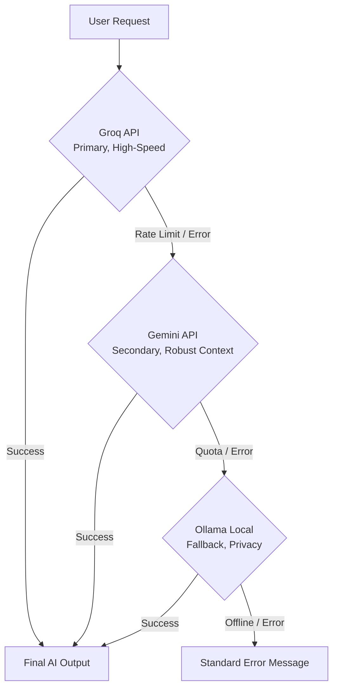

# 🚀 AI-Powered Data Analysis Platform


## 📌 Overview
The **AI-Powered Data Analysis Platform** is an intelligent, unified workspace designed to automate and simplify complex data science workflows. It empowers data analysts, students, and business professionals to perform sophisticated exploratory data analysis, data cleaning, machine learning, and report generation without requiring extensive coding expertise. By leveraging advanced dual-LLM routing, it brings AI-driven narratives and natural language query capabilities directly to your datasets.

## ✨ Features
- **📊 Smart EDA** — automated exploratory data analysis with AI narrative
- **🧹 Data Cleaning** — auto-clean with AI recommendations and downloadable CSV
- **🤖 ML Recommender** — trains 5 models, ranked comparison, AI summary
- **📈 Data Insights Dashboard** — BI-style visualisations with business insights
- **💬 NL Query Engine** — plain English to Pandas code via LLM
- **📄 Report Generator** — one-click 7-page professional PDF report

## 🛠 Tech Stack

| Category | Technology |
| :--- | :--- |
| **Frontend UI** | Streamlit |
| **Data Processing** | Python, Pandas, NumPy, Scikit-learn |
| **Visualisation** | Plotly, Matplotlib, Seaborn |
| **AI / LLMs** | Groq (Llama-3), Google Gemini Pro, Ollama (Local Fallback) |
| **Reporting** | ReportLab, PyFPDF / Markdown |
| **Testing** | Pytest, unittest |

## 🧠 AI Architecture
The platform uses an intelligent cascading LLM architecture to deliver fast and reliable AI responses.



*Text Diagram:*
`User Query` ➔ `Groq (Primary, Fast)` ➔ *(fallback)* ➔ `Gemini (Secondary)` ➔ *(fallback)* ➔ `Ollama (Local, Offline)` ➔ `Response`

## 📂 Project Structure
```text
ai-data-platform/
├── README.md
├── app.py
├── requirements.txt
├── .env
├── assets/
│   └── style.css
├── llm/
│   ├── client_factory.py
│   ├── gemini_client.py
│   ├── groq_client.py
│   ├── ollama_client.py
│   └── prompts.py
├── modules/
│   ├── data_cleaner.py
│   ├── eda.py
│   ├── ml_engine.py
│   ├── nl_query.py
│   ├── report_gen.py
│   └── visualisation.py
├── tests/
│   ├── test_data_loader.py
│   ├── test_eda.py
│   ├── test_ml.py
│   ├── test_nl_query.py
│   ├── test_ollama_client.py
│   ├── test_prompts.py
│   └── test_report_gen.py
└── utils/
    ├── data_loader.py
    ├── validators.py
    └── visualizations.py
```

## ⚙️ Setup Instructions

Follow these step-by-step instructions to run the platform locally:

1. **Clone the repository**
   ```bash
   git clone https://github.com/RajatThakral01/ai-data-platform.git
   cd ai-data-platform
   ```

2. **Create a virtual environment**
   ```bash
   python -m venv .venv
   source .venv/bin/activate  # On Windows use: .venv\Scripts\activate
   ```

3. **Install dependencies**
   ```bash
   pip install -r requirements.txt
   ```

4. **Configure Environment Variables**
   Create a `.env` file in the root directory and add your API keys:
   ```env
   GROQ_API_KEY=your_groq_api_key
   GEMINI_API_KEY=your_gemini_api_key
   # OLLAMA_HOST=http://localhost:11434 (optional, default is localhost)
   ```
   *Get your free keys here: [Groq Cloud](https://console.groq.com/keys) | [Google AI Studio](https://aistudio.google.com/app/apikey)*

5. **Install and start Ollama (Optional)**
   - Download from [Ollama.com](https://ollama.com/)
   - Start Ollama and pull a model (e.g. `llama3` or `mistral`): 
     ```bash
     ollama run llama3
     ```

6. **Run the Streamlit app**
   ```bash
   streamlit run app.py
   ```

## 💡 Usage

Navigate through the platform linearly for the best experience:
1. **Upload Dataset:** Start by uploading a CSV or Excel file via the sidebar.
2. **🧹 Data Cleaning:** Handle missing values, drop duplicates, and apply AI-recommended cleaning strategies. Download the clean dataset if needed.
3. **📊 Smart EDA:** Get a statistical summary, correlation matrices, and AI-driven data narratives explaining the shape and distribution of your data.
4. **📈 Data Insights Dashboard:** Explore BI-style visualisations and extract deep business insights automatically generated by the LLM.
5. **💬 NL Query Engine:** Ask questions in plain English (e.g., "What is the average sales per region?") and get instant Python/Pandas code execution and answers.
6. **🤖 ML Recommender:** Select a target column, and the module will train 5 models and present a ranked comparison with an AI summary of performance.
7. **📄 Report Generator:** Finally, click one button to generate and download a comprehensive 7-page highly professional PDF report detailing all analysis and insights.

## ✅ Test Results
The platform ensures high reliability with robust automated testing.
- **Status:** **167/167 tests passing**

## 👨‍💻 Project Info

- **Student:** Rajat Thakral | 2022BTECH080
- **Institution:** JK Lakshmipat University, Jaipur
- **Program:** BTech Practice School II
- **Faculty Supervisor:** Mr. Raushan Kumar
- **GitHub:** [github.com/RajatThakral01/ai-data-platform](https://github.com/RajatThakral01/ai-data-platform)

## 📄 License
This project is licensed under the **MIT License**.
